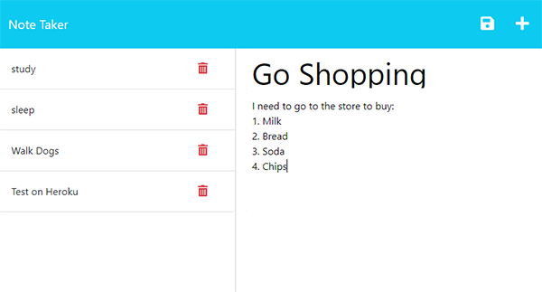

# Organize-Your-Life-With-Note-Taker

## Description

This project allows the user to quickly add or delete a note/reminder and store the notes in a database so they will remain until deleted.  During this project, I learned about routes, servers, and deploying a project to Heroku.

## Table of Contents (Optional)

- [Installation](#installation)
- [Usage](#usage)
- [Credits](#credits)
- [License](#license)

## Installation

This project required express to create, however, it requires no installation to use the app on the deployed page.

## Usage

Link to deployed page: https://organize-your-life.herokuapp.com/notes 

This is an easy to use note taking app.  To add a note, simply type in a note title, type in additional details in the note text, then hit the 'save' icon in the top right corner.  To delete a note, find the note you want to delete on the list of notes and click the 'trash can' to delete.  To view an existing note, just click on the note you would like to view and it will open on the right side.  To add a new note after viewing a note, click the 'Plus" symbol in the top right corner.
  

  

## Credits

1. I used examples in our class mini project to begin the project. 

2. I watched the video "Node Express Tutorial 5 - Making a DELETE request" on the Brett M youtube channel to get part of my method of creating a delete request, specifically how to get the notes_id to equal req.params.  Here is a link to the video: https://www.youtube.com/watch?v=K9jTQPb0Xso  

3. I got the idea to use filter() to delete my item from a Stack Overflow page titled, "Express.js delete request" made by user Syscall.  Here is a link to the page: https://stackoverflow.com/questions/61526572/express-js-delete-request

4. This project came with starter code which can be found in the public folder.

## License

MIT License

For additional license information, please see the LICENSE document in the repository.